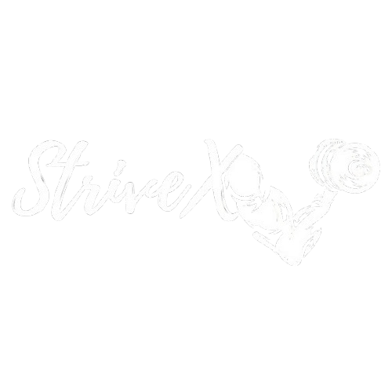

<div align="center">
  <div align="center">
  
</div>

  # StriveX - SaaS-Based AI Fitness App 💪🤖

  ## Transform Your Fitness Journey with Intelligent Technology

  <div>
    
    
    
  </div>

</div>

## 🌟 Revolutionizing Fitness with AI and Expertise

StriveX is more than just an app—it's your personal AI-powered fitness companion. We blend cutting-edge artificial intelligence with expert human guidance to create a truly transformative fitness experience.

### 🎥 Animated Walkthrough
<div style="text-align: center;">
  
</div>


## ✨ Breakthrough Features

### 🤖 AI-Powered Personalization

- **Smart Workout Generation**
  - Adaptive routines based on your unique body and goals
  - Supports Yoga, Cardio, Pilates, and more
  - Real-time form and progress tracking

- **Intelligent Nutrition Planning**
  - Personalized meal plans
  - Adapts to your dietary preferences and fitness objectives
  - Nutritional insights and recommendations

### 💪 Comprehensive Fitness Ecosystem

#### User Experience

- **Seamless Onboarding**
  - Quick profile creation
  - Comprehensive fitness assessment
  - Personalized goal setting

- **Interactive Workout Player**
  - Integrated timers
  - Music synchronization
  - Video guidance
  - Performance tracking

#### Trainer Tools

- **Professional Management**
  - Client progress tracking
  - Custom task assignment
  - Real-time communication
  - Performance analytics

## 🚀 Why Choose StriveX?

### The Perfect Blend of Technology and Expertise
- **AI Precision**: Algorithmic workout and diet optimization
- **Human Touch**: Real trainer support and guidance
- **Accessibility**: Web-based SaaS platform
- **Flexibility**: Free and premium tiers

## 🛠️ Cutting-Edge Technology Stack

<div align="center">
 


  ### Frontend
  
  

  ### Backend
  
  
  

  ### AI & Integrations
  
  
  
</div>

## 🚀 Quick Start Guide

### Prerequisites
- Node.js (v16+)
- MongoDB
- Git

### Installation Steps
```bash
# Clone the repository
git clone https://github.com/mohammedrimshan/StriveX---SaaS-Based-AI-Fitness-App.git
cd strivex

# Install dependencies
npm install

# Set up environment
cp .env.example .env
# Edit .env with your configurations

# Run the application
npm run dev
```

## 🤝 Contribute to StriveX

1. Fork the Repository
2. Create Feature Branch (`git checkout -b feature/AmazingFeature`)
3. Commit Changes (`git commit -m 'Add some AmazingFeature'`)
4. Push to Branch (`git push origin feature/AmazingFeature`)
5. Open Pull Request

## 📞 Connect With Us

- **Email**: support@strivex.ai
- **Twitter**: [@StriveXFitness](https://twitter.com/strivexfitness)
- **Website**: [www.strivex.ai](https://www.strivex.ai)

## 📄 License

Distributed under the MIT License. See `LICENSE` for more information.

---

<div align="center">
  <strong>🌟 Star the Project | 🤖 Transform Your Fitness Journey 💪</strong>

  [](https://GitHub.com/yourusername/strivex/stargazers/)
</div>
